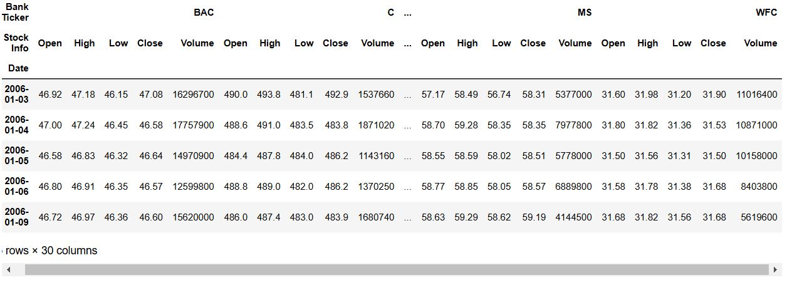
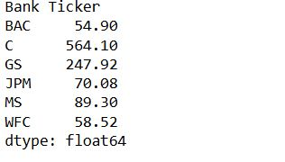
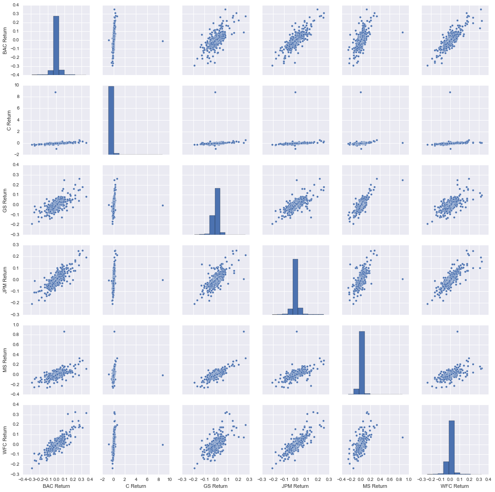
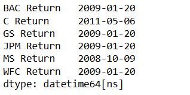
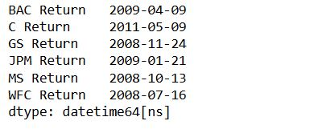
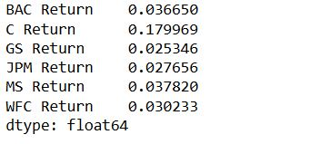
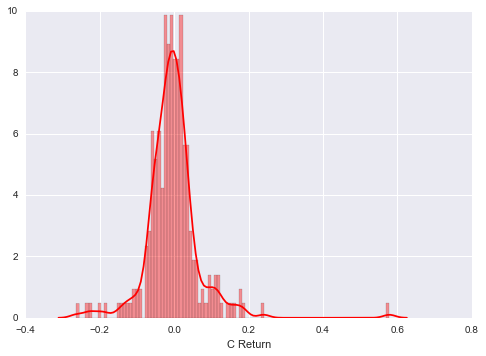
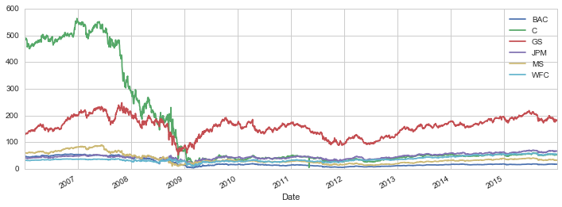
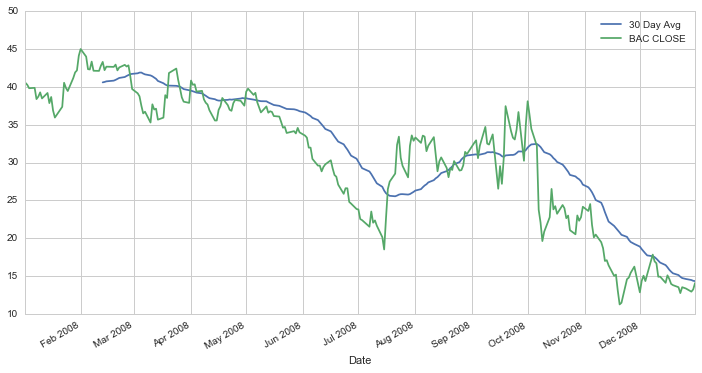
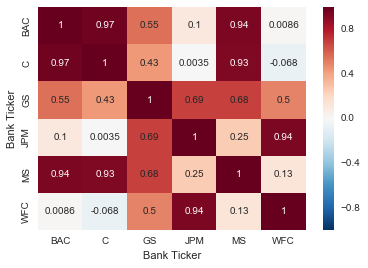

# Data-Analysis-of-stock-prices
## DataFrame of Stock Parameters of Different Banks

## Max Close price for each bank's stock throughout the time period

## Visualization of return for each bank's stock

## Worst Drop of stocks

## Best Single Day Gain

## Determining riskiest stock by calculating Standard Deviation

## A Distplot using seaborn of the 2008 returns for CitiGroup

## A line plot showing Close price for each bank for the entire index of time

## Plot of the rolling 30-day average against the Close Price for Bank Of America's stock for the year 2008

## A heatmap of the correlation between the stocks Close Price.

